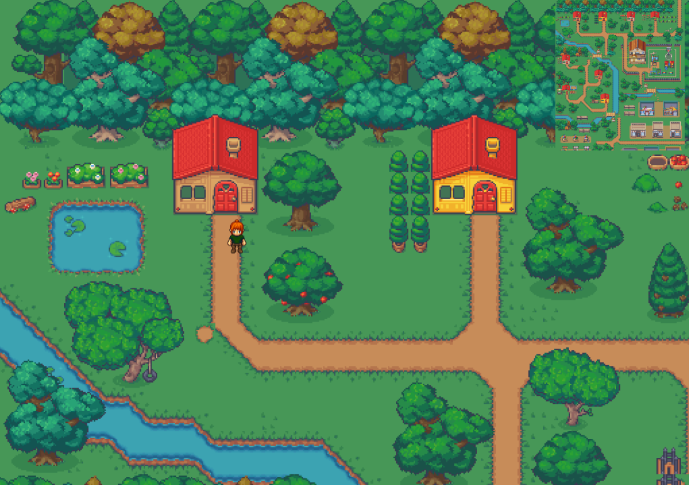

# Dream World

A simple visual novel laying out how an ideal day looks like for fictional character Jamie in a dream setting.

## Background

The motivation behind this is to solidify Javascript, as well as React concepts that I've been learning. I've always loved the simple pixel art style I've seen in games, and this will be a perfect opportunity to create mine myself! Besides, this project has a lot of scope for further expansion.

## Built With:

- [Phaser 3](https://phaser.io/)
- [React](https://react.dev/)
- [Vite](https://vitejs.dev/)
- [Tiled](https://www.mapeditor.org/)
- [LimeZu's awesome Modern Exterior Tileset!](https://limezu.itch.io/modernexteriors)
- [DialogBox art by Gabriel](https://opengameart.org/content/10-basic-message-boxes)

Starter template from Phaser:
- [Phaser3 Template](https://github.com/phaserjs/template-react)

## Requirements

[Node.js](https://nodejs.org) is required to install dependencies and run scripts via `npm`.

## Clone Project

`git clone https://github.com/lslimpg/dream-world.git`

## Available Commands

| Command         | Description                                    |
| --------------- | ---------------------------------------------- |
| `npm install`   | Install project dependencies                   |
| `npm run dev`   | Launch a development web server                |
| `npm run build` | Create a production build in the `dist` folder |

## Run Project

After cloning the repo, run `npm install` from project directory. Then, start the local development server by running `npm run dev`.

The local development server runs on `http://localhost:8080`.

## Project Structure

- `index.html` - A basic HTML page to contain the game.
- `src` - Contains the React client source code.
- `src/main.jsx` - The main **React** entry point. This bootstraps the React application.
- `src/App.jsx` - The main React component.
- `src/game/PhaserGame.jsx` - The React component that initializes the Phaser Game and serve like a bridge between React and Phaser.
- `src/game/EventBus.js` - A simple event bus to communicate between React and Phaser.
- `src/game` - Contains the game source code.
- `src/game/main.jsx` - The main **game** entry point. This contains the game configuration and start the game.
- `src/game/scenes/` - The Phaser Scenes are in this folder.
- `public/style.css` - Some simple CSS rules to help with page layout.
- `public/assets` - Contains the static assets used by the game.
